# V2 Ecommerce Website

It is an e-commerce website used for ordering stylish and trending fashion products. It is a user-friendly and responsive website.

[Visit Now](https://ecommerce-frontend-utt4.onrender.com/) 🚀

## 🖥️ Tech Stack

### Frontend:

### Backend:

## Features
* The project has two interface i.e. an user interface and an admin interface.
* At user-end he/she can order product and set the quantity as per there requirement.
* At user-end he/she can also view there profile details.
* At admins-end he/she can perform two tasks:
    * Add new product to the cart.
    * Remove existing product from the cart.

* Use JsonWebToken(JWT) for user login and register.

## NPM Packages I Used :
- react-router-dom
- dotenv (for environmental variables)
- react-icons
- cors (for Frontend-Backend Communication)
- jsonwebtoken (for user secure authentication)
- multer (for uploading and handeling backend images)
- nodemon (for auto-restart the backend server)

## Screenshots
Here are some of the Screenshots of V2 E-commerce Website.
[Visit Now](https://ecommerce-frontend-utt4.onrender.com/) 🚀

### 1. Hero Section
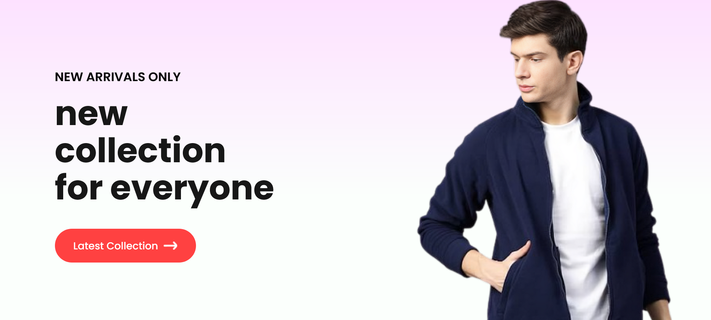
### 2. Popular in Women Section
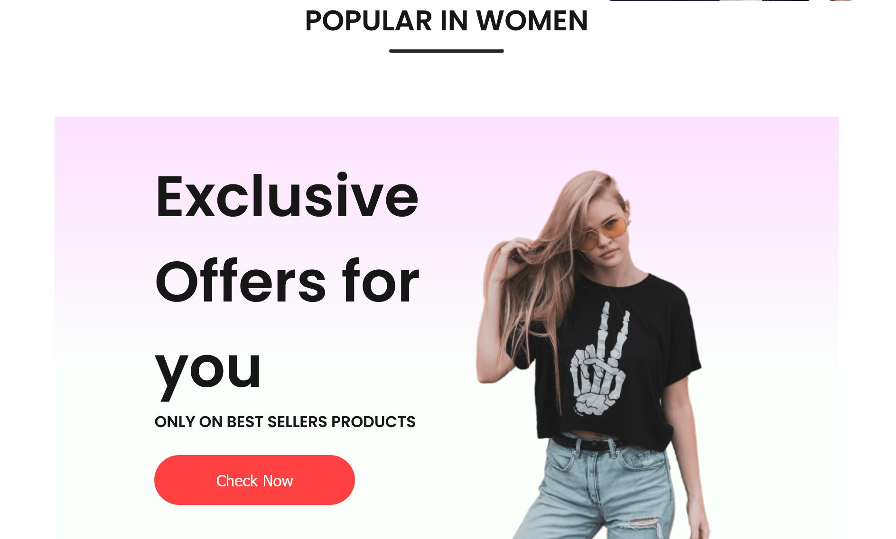
### 3. New Collections Section
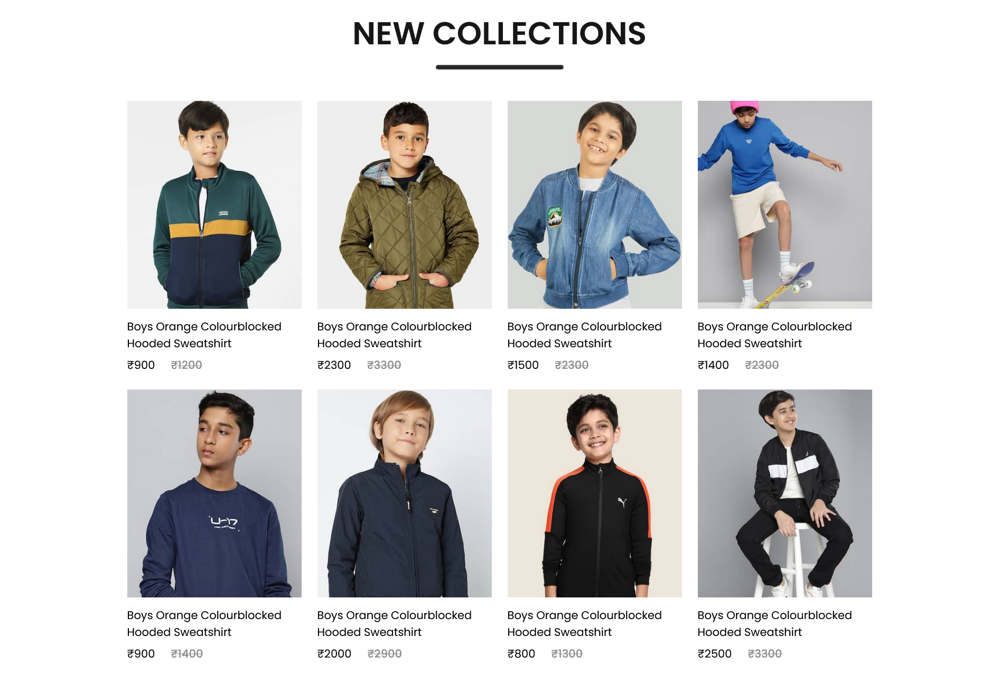
### 4. Popular in Women Section

### 5. Men Page
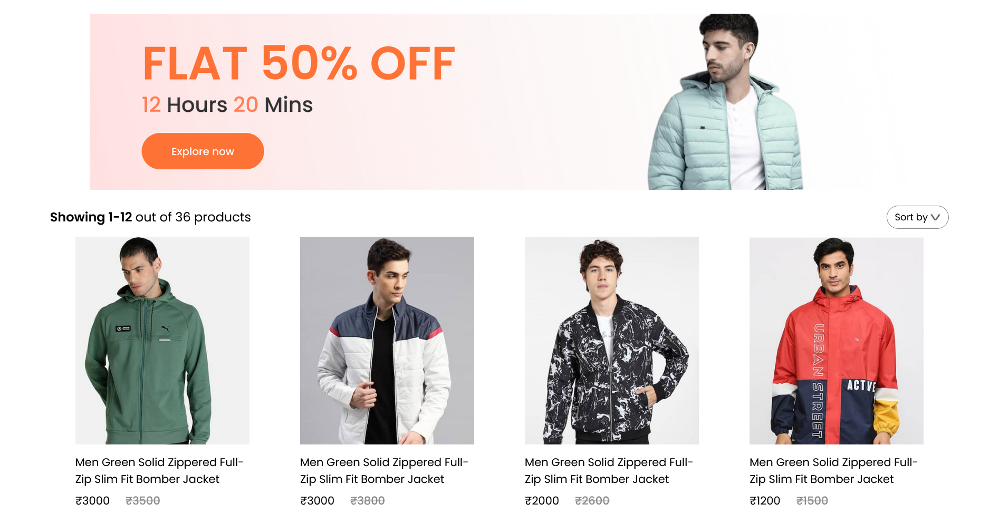
### 6. Women Page
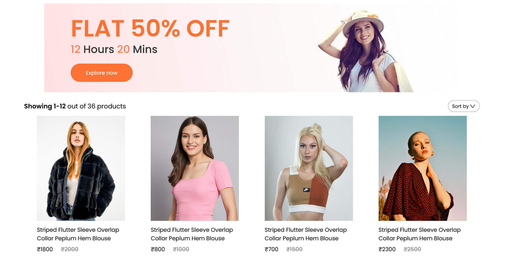
### 7. Kids Page
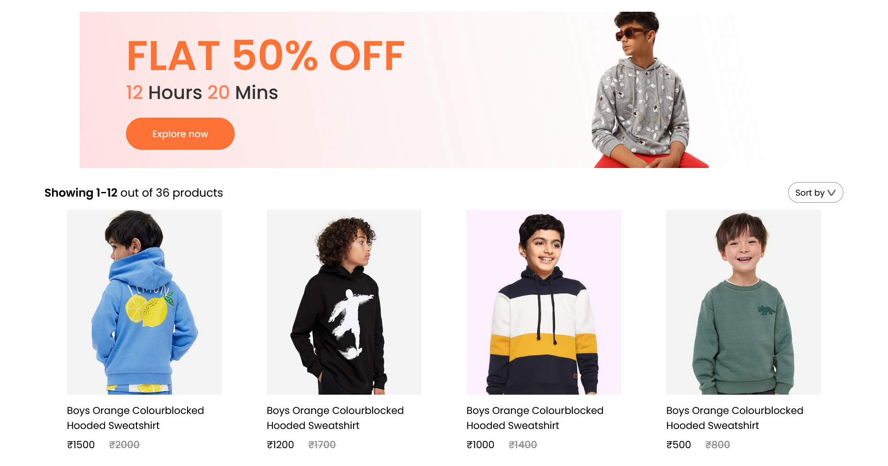
### 8. Login Popup
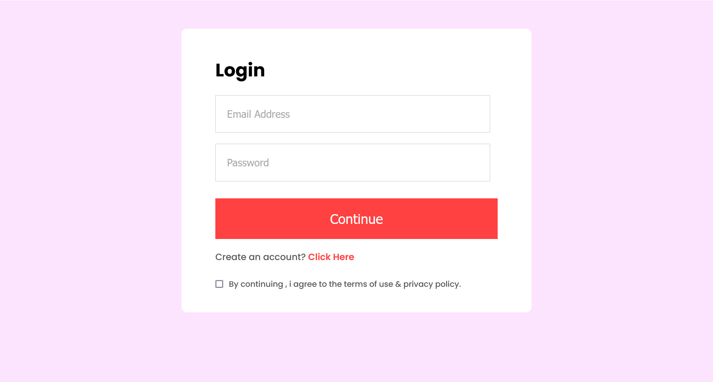
### 9. SignIn Popup
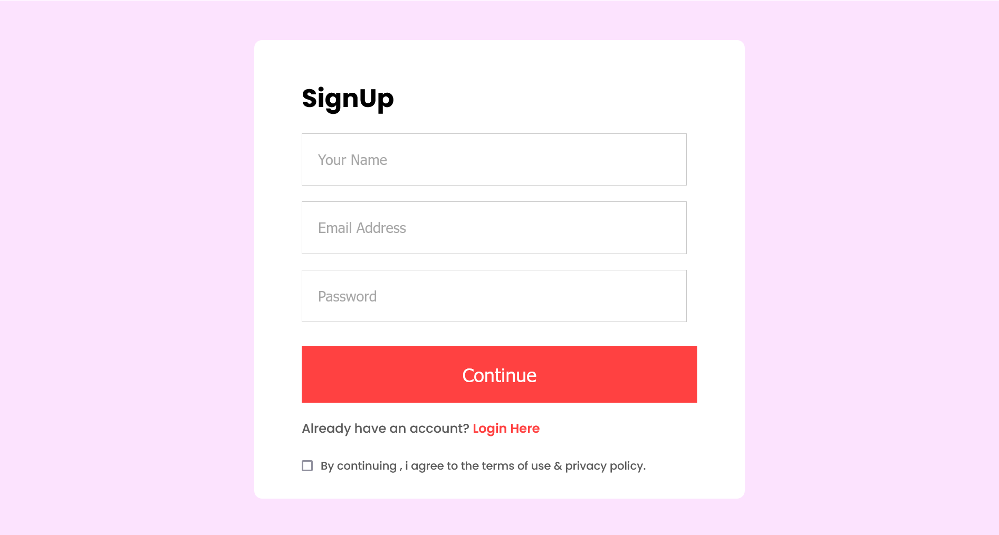
### 10. Product Page
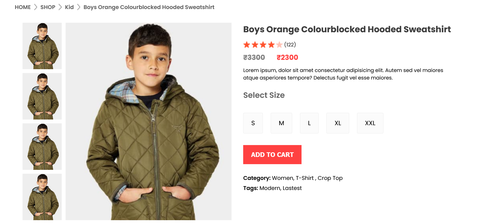
### 11. Cart Page
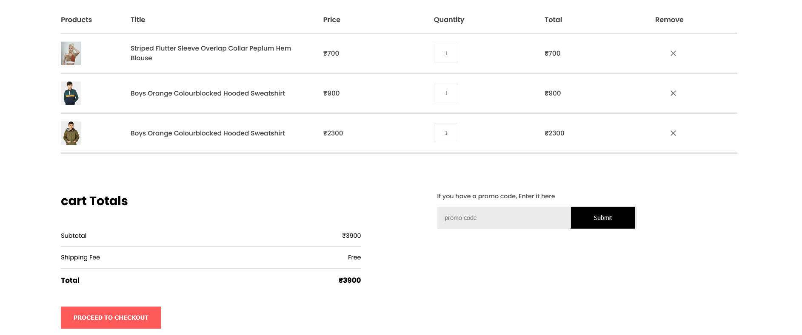

## Admins End 
[Visit Now](https://ecommerce-admin-vqnn.onrender.com) 🚀

### 12. Add Product Page
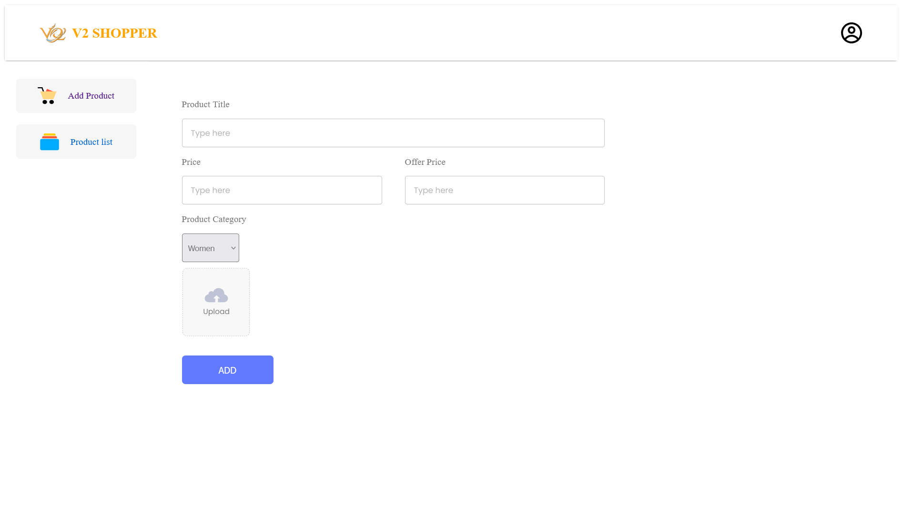
### 13. Products List Page
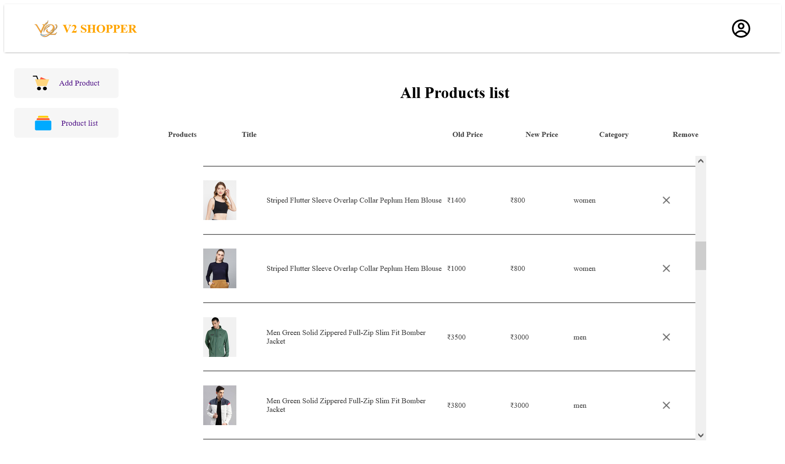